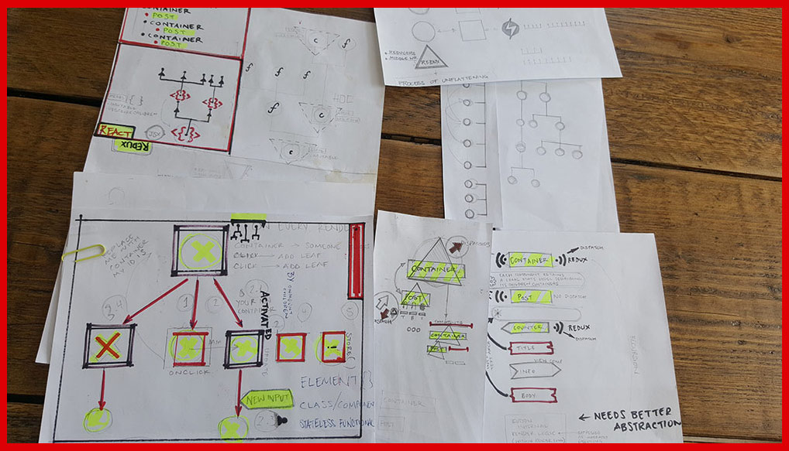
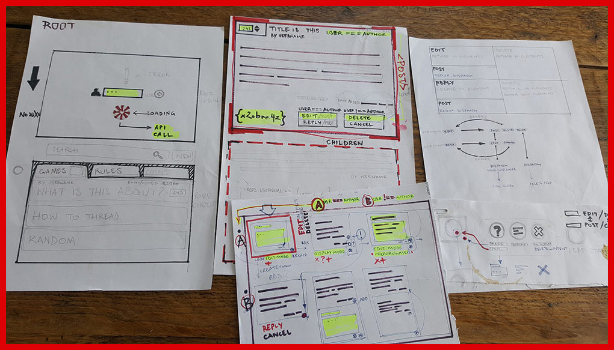
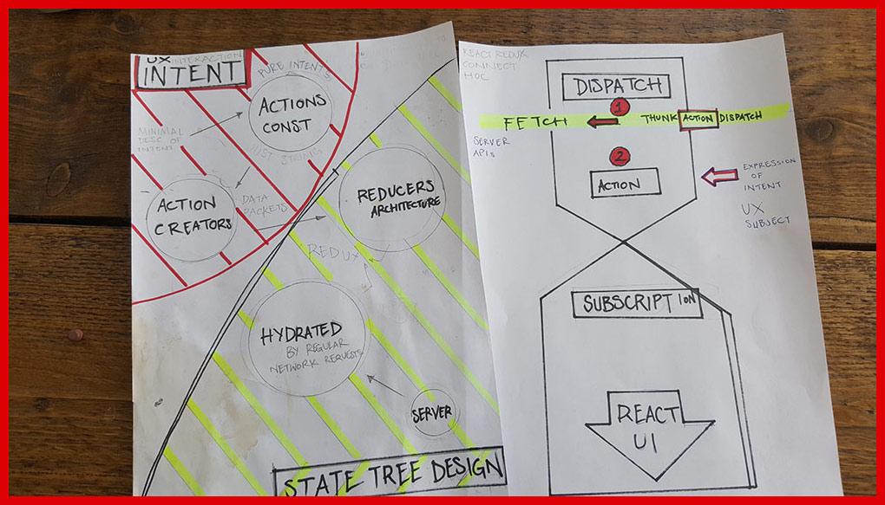

# React Recursive Comment System



A Flat / Normalised *posts* object is retrieved from the server, used as _hydated state_ in a **redux store**, then
rearranged into a tree datastructure and built out as React UI.

React technologies in use:

*   React
*   Redux - to separate state and UX intent
*   React-Redux  - provide an alternative prop forwarding technique then _prop drilling_
*   Redux-Thunk - to asynchronously communicate with server and dispatch redux actions
*   React Router v4 - to provide View functionalities and make the address bar a form of data input (user name)


## The Process

A composite data structure (in the form of an object) is generated from the flat server data structure.  This new data structure is a reflection of the nested structure the UI must output.  This new nested datastructure is used to recursively construct  **Container** components and populate them with properties

**Normalised / Flat / Shallow data object object example :**

                {   'a':{
                        parent:'a',
                        id:'a',
                        // properties } ,
                    'b':{
                        parent:'a',
                        id:'b',
                        // properties } ,
                    'c':{
                        parent:'b',
                        id:'c',
                        // properties } }


**In *psuedocode* turns to a composite data structure with a children property:**

                a.children = [ b.children = [ c ] ]


The reconfiguring of data is achieved with functions such as the link() in utilities.js (line 32)


                const link = ( nodeA, nodeB ) => {
                    const   { parent }= nodeA , { id }= nodeB ;
                            // if NodeA.parent  == NodeB.id
                            if ( parent===id ) {
                                // add to children array and return true
                                ( nodeB.children || ( nodeB.children= []))
                                    .push(nodeA) ;
                                return true ;   }
                            // if NodeB.id !== NodeA.parent check for children
                            else if ( nodeB.children ) {
                                for( let childNode of nodeB.children)
                                    if ( link(nodeA, childNode) ) return true ;
                            } else {
                                // if NodeA and NodeB are not directly linked
                                return false
                            }   }

The 2 data structures are then used for specific purposes.  The original datastructure is stored in redux state.  While the new data structure is used in a recursive function to build the comment UI.

## UI Logic


### Threads

A component that utilises the extract utilities.js method to build the composite datastructure and then recursively build out as nested Container components.

        /*
            the children property refers to a property on the props object ( see: extract )
            not react component props.children.  The results are nested components
            (accesible in Container as regular children)
        */

        const composer= Component=> {
            const nest= ({children, ...props})=>
                    <Component {...{ key:props.id, ...props }}>
                        {   children && children.map( props=> nest(props) ) }
                    </Component> ;
            return nest ;
            } ;

then used as a **higher order component** / _curried_ function:

            render=_=>(
                <div className='wrapper'>
                    { composer(Container)(this.ui_object_tree) }
                </div>
            ) ;

### Container

A _recursive_ component that can create nested Containers and render them.  Nested post containers happen at 2 times in the app lifecycle. On **Mounting**, in which data from the server is used to reconstruct comment trees. And on **user interaction** (to reply / add a comment) .  The addition of new comments means that each Container needs to modify the list of nested Container components and as such needs to store Container data in state.

To achieve this, on Mount in the class constructor, each individual Container collects its children into a state.comments property, exposing needed element properties for sorting and tracking. this is achieved using ```React.Children.map```

            constructor(props){ super(props) ;
                /*
                    children components are rendered from state instead of props
                    because user needs to be able to modify the list
                    either with via concat() or sort()
                */
                this.state.comments=
                    React.Children.map(this.props.children,
                        child=> {
                            const {id, voteScore, timestamp}= child.props // extract props used by sorting mechanism
                            return { id, voteScore , timestamp , child }}
                        ) || [] ;
            } ;


Comments (initially passed as props.children) are finally rendered from state, allowing them to be sorted via external controls without being able to peer in to the Element properties.

Additionaly each Container is passed references to certain parent container methods so that adding ane removing nested containers can be implemented

### Post

Subscribes to the redux store but makes no dispatches, it delegates all dispatches to parent (Container).
This setup seems counter intuitive use of redux as it doesn't take advantage of the ability to not propagate properties.  Everything is connected
as Containers are recursively nested.

It's main purpose is to retain a flat state shape on the redux end for easy transference to servers in bulk

## UX Design

#### Separating User Intent / Interaction



One of the powerful concepts introduced by **Redux** is the separation of **intent** in the form of **actions** .  As a result interaction with the application is defined semantically and then used to modify the application state.  This is a **great overlap** between development and UX design.  Specifying interactive intent early on, as well as deciding on **state shape** , help guide the process because a user's interaction with the app, needs to be considered in parallel with the app architecture design